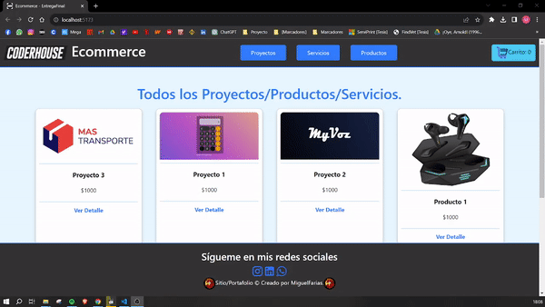

# EntregaFinal-Ecommerce+MiguelFarias58160-CoderHouse

This Product is being built

## Running

```bash
$ npm install
$ npm run dev
```

## Built Using

- [React](https://react.dev/)
- [Vercel](https://vercel.com)
- [Firebase](https://firebase.com)
- [Bootstrap](https://getbootstrap.com/)

## Test App 

[Deploy](https://entrega-final-ecommerce-miguel-farias58160.vercel.app/)



# React + Vite

This template provides a minimal setup to get React working in Vite with HMR and some ESLint rules.

Currently, two official plugins are available:

- [@vitejs/plugin-react](https://github.com/vitejs/vite-plugin-react/blob/main/packages/plugin-react/README.md) uses [Babel](https://babeljs.io/) for Fast Refresh
- [@vitejs/plugin-react-swc](https://github.com/vitejs/vite-plugin-react-swc) uses [SWC](https://swc.rs/) for Fast Refresh
